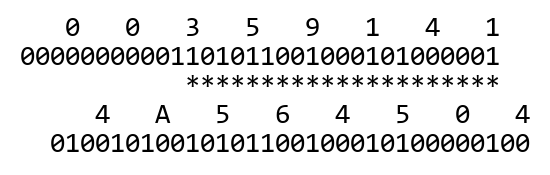

# 练习题答案

> 编校提示（非原文）：本章可唯一确定的排印错误已更正，原书记录及其他疑点见[练习题答案编校说明](../answer-editorial-notes.md)。

## 练习题 2.1

在我们开始查看机器级程序的时候，理解十六进制和二进制格式之间的关系将是很重要的。虽然本书中介绍了完成这些转换的方法，但是做点练习能够让你更加熟练。

A. 将 0x39A7F8 转换成二进制：

| 十六进制 | 3 | 9 | A | 7 | F | 8 |
|---|---|---|---|---|---|---|
| 二进制 | 0011 | 1001 | 1010 | 0111 | 1111 | 1000 |

B. 将二进制 1100100101111011 转换成十六进制：

| 二进制 | 1100 | 1001 | 0111 | 1011 |
|---|---|---|---|---|
| 十六进制 | C | 9 | 7 | B |

C. 将 0xD5E4C 转换成二进制：

| 十六进制 | D | 5 | E | 4 | C |
|---|---|---|---|---|---|
| 二进制 | 1101 | 0101 | 1110 | 0100 | 1100 |

D. 将二进制 1001101110011110110101 转换成十六进制：

| 二进制 | 10 | 0110 | 1110 | 0111 | 1011 | 0101 |
|---|---|---|---|---|---|---|
| 十六进制 | 2 | 6 | E | 7 | B | 5 |

## 练习题 2.2

这个问题给你一个机会思考 2 的幂和它们的十六进制表示。

| n | 2<sup>n</sup>（十进制） | 2<sup>n</sup>（十六进制） |
| --- | --- | --- |
| 9 | 512 | 0x200 |
| 19 | 524 288 | 0x80000 |
| 14 | 16 384 | 0x4000 |
| 16 | 65 536 | 0x10000 |
| 17 | 131 072 | 0x20000 |
| 5 | 32 | 0x20 |
| 7 | 128 | 0x80 |

## 练习题 2.3

这个问题给你一个机会试着对一些小的数在十六进制和十进制表示之间进行转换。对于较大的数，使用计算器或者转换程序会更加方便和可靠。

| 十进制 | 二进制 | 十六进制 |
| --- | --- | --- |
| 0 | 0000 0000 | 0x00 |
| 167 = 10 · 16 + 7 | 1010 0111 | 0xA7 |
| 62 = 3 · 16 + 14 | 0011 1110 | 0x3E |
| 188 = 11 · 16 + 12 | 1011 1100 | 0xBC |
| 3 · 16 + 7 = 55 | 0011 0111 | 0x37 |
| 8 · 16 + 8 = 136 | 1000 1000 | 0x88 |
| 15 · 16 + 3 = 243 | 1111 0011 | 0xF3 |
| 5 · 16 + 2 = 82 | 0101 0010 | 0x52 |
| 10 · 16 + 12 = 172 | 1010 1100 | 0xAC |
| 14 · 16 + 7 = 231 | 1110 0111 | 0xE7 |

## 练习题 2.4

当开始调试机器级程序时，你将发现在许多情况中，一些简单的十六进制运算是很有用的。可以总是把数转换成十进制，完成运算，再把它们转换回来，但是能够直接用十六进制工作更加有效，而且能够提供更多的信息。

A. 0x503c + 0x8 = 0x5044。8 加上十六进制 c 得到 4 并且进位 1。

B. 0x503c - 0x40 = 0x4ffc。在第二个数位，3 减去 4 要从第三位借 1。因为第三位是 0，所以我们必须从第四位借位。

C. 0x503c + 64 = 0x507c。十进制 64（2<sup>6</sup>）等于十六进制 0x40。

D. 0x50ea - 0x503c = 0xae。十六进制数 a（十进制 10）减去十六进制数 c（十进制 12），我们从第二位借 16，得到十六进制数 e（十进制数 14）。在第二个数位，我们现在用十六进制 d（十进制 13）减去 3，得到十六进制 a（十进制 10）。

## 练习题 2.5

这个练习测试你对数据的字节表示和两种不同字节顺序的理解。

| 调用 | 小端法 | 大端法 |
|---|---|---|
| A | 21 | 87 |
| B | 21 43 | 87 65 |
| C | 21 43 65 | 87 65 43 |

回想一下，show_bytes 列举了一系列字节，从低位地址的字节开始，然后逐一列出高位地址的字节。在小端法机器上，它将按照从最低有效字节到最高有效字节的顺序列出字节。在大端法机器上，它将按照从最高有效字节到最低有效字节的顺序列出字节。

## 练习题 2.6

这又是一个练习从十六进制到二进制转换的机会。同时也让你思考整数和浮点表示。我们将在本章后面更加详细地研究这些表示。

A. 利用书中示例的符号，我们将两个串写成：



B. 将第二个字相对于第一个字向右移动 2 位，我们发现一个有 21 个匹配位的序列。

C. 我们发现除了最高有效位 1，整数的所有位都嵌在浮点数中。这正好也是书中示例的情况。另外，浮点数有一些非零的高位不与整数中的高位相匹配。

## 练习题 2.7

它打印 `61 62 63 64 65 66`。回想一下，库函数 strlen 不计算终止的空字符，所以 show_bytes 只打印到字符 `'f'`。

## 练习题 2.8

这是一个帮助你更加熟悉布尔运算的练习。

| 运算 | 结果 | 运算 | 结果 |
| --- | --- | --- | --- |
| a | [01101001] | a&b | [01000001] |
| b | [01010101] | a\|b | [01111101] |
| ~a | [10010110] | a ^ b | [00111100] |
| ~b | [10101010] | | |

## 练习题 2.9

这个问题说明了怎样用布尔代数来描述和解释现实世界的系统。我们能够看到这个颜色代数和长度为 3 的位向量上的布尔代数是一样的。

A. 颜色的取补是通过对 R、G 和 B 的值取补得到的。由此，我们可以看出，白色是黑色的补，黄色是蓝色的补，红紫色是绿色的补，蓝绿色是红色的补。

B. 我们基于颜色的位向量表示来进行布尔运算。据此，我们得到以下结果：

| 运算 | 结果 |
|---|---|
| 蓝色（001）`\|` 绿色（010） | 蓝绿色（011） |
| 黄色（110）`&` 蓝绿色（011） | 绿色（010） |
| 红色（100）`^` 紫红色（101） | 蓝色（001） |

## 练习题 2.10

这个程序依赖于两个事实，EXCLUSIVE-OR 是可交换的和可结合，以及对于任意的 a，有 a ^ a = 0。

| 步骤 | *x | *y |
| --- | --- | --- |
| 初始 | a | b |
| 步骤 1 | a | a ^ b |
| 步骤 2 | a ^ (a ^ b) = (a ^ a) ^ b = b | a ^ b |
| 步骤 3 | b | b ^ (a ^ b) = (b ^ b) ^ a = a |

某种情况下这个函数会失败，参见练习题 2.11。

## 练习题 2.11

这个题目说明了我们的原地交换例程微妙而有趣的特性。

A. first 和 last 的值都为 k，所以我们试图交换正中间的元素和它自己。

B. 在这种情况中，inplace_swap 的参数 x 和 y 都指向同一个位置。当计算 `*x ^ *y` 的时候，我们得到 0。然后将 0 作为数组正中间的元素，而后面的步骤一直都把这个元素设置为 0。我们可以看到，练习题 2.10 的推理隐含地假设 x 和 y 代表不同的位置。

C. 将 reverse_array 的第 4 行的测试简单地替换成 `first<last`，因为没有必要交换正中间的元素和它自己。

## 练习题 2.12

这些表达式如下：

A. `x & 0xFF`

B. `x^~0xFF`

C. `x | 0xFF`

这些表达式是在执行低级位运算中经常发现的典型类型。表达式 `~0xFF` 创建一个掩码，该掩码 8 个最低位等于 0，而其余的位为 1。可以观察到，这些掩码的产生和字长无关。而相比之下，表达式 `0xFFFFFF00` 只能工作在 32 位的机器上。

## 练习题 2.13

这个问题帮助你思考布尔运算和程序员应用掩码运算的典型方式之间的关系。代码如下：

```c
/* Declarations of functions implementing operations bis and bic */
int bis(int x, int m);
int bic(int x, int m);

/* Compute x|y using only calls to functions bis and bic */
int bool_or(int x, int y) {
    int result = bis(x,y);
    return result;
}

/* Compute x^y using only calls to functions bis and bic */
int bool_xor(int x, int y) {
    int result = bis(bic(x,y), bic(y,x));
    return result;
}
```

bis 运算等价于布尔 OR——如果 x 中或者 m 中的这一位置位了，那么 z 中的这一位就置位。另一方面，bic(x,m) 等价于 `x&~m`；我们想实现只有当 x 对应的位为 1 且 m 对应的位为 0 时，该位等于 1。

由此，可以通过对 bis 的一次调用来实现 `|`。为了实现 `^`，我们利用以下属性

```text
x ^ y = (x & ~y) | (~x & y)
```

## 练习题 2.14

这个问题突出了位级布尔运算和 C 语言中的逻辑运算之间的关系。常见的编程错误是在想用逻辑运算的时候用了位级运算，或者反过来。

| 表达式 | 值 | 表达式 | 值 |
| --- | --- | --- | --- |
| x & y | 0x20 | x && y | 0x01 |
| x \| y | 0x7F | x \|\| y | 0x01 |
| ~x \| ~y | 0xDF | !x \|\| !y | 0x00 |
| x & !y | 0x00 | x && ~y | 0x01 |

## 练习题 2.15

这个表达式是 `!(x ^ y)`。

也就是，当且仅当 x 的每一位和 y 相应的每一位匹配时，`x ^ y` 等于零。然后，我们利用 `!` 来判定一个字是否包含任何非零位。

没有任何实际的理由要去使用这个表达式，因为可以简单地写成 `x==y`，但是它说明了位级运算和逻辑运算之间的一些细微差别。

## 练习题 2.16

这个练习可以帮助你理解各种移位运算。

| x 十六进制 | x 二进制 | x&lt;&lt;3 二进制 | x&lt;&lt;3 十六进制 | （逻辑）x&gt;&gt;2 二进制 | （逻辑）x&gt;&gt;2 十六进制 | （算术）x&gt;&gt;2 二进制 | （算术）x&gt;&gt;2 十六进制 |
| --- | --- | --- | --- | --- | --- | --- | --- |
| 0xC3 | [11000011] | [00011000] | 0x18 | [00110000] | 0x30 | [11110000] | 0xF0 |
| 0x75 | [01110101] | [10101000] | 0xA8 | [00011101] | 0x1D | [00011101] | 0x1D |
| 0x87 | [10000111] | [00111000] | 0x38 | [00100001] | 0x21 | [11100001] | 0xE1 |
| 0x66 | [01100110] | [00110000] | 0x30 | [00011001] | 0x19 | [00011001] | 0x19 |

## 练习题 2.17

一般而言，研究字长非常小的例子是理解计算机运算的非常好的方法。

无符号值对应于图 2-2 中的值。对于补码值，十六进制数字 0～7 的最高有效位为 0，得到非负值，然而十六进制数字 8～F 的最高有效位为 1，得到一个为负的值。

| x⃗ 十六进制 | x⃗ 二进制 | B2U<sub>4</sub>(x⃗) | B2T<sub>4</sub>(x⃗) |
| --- | --- | --- | --- |
| 0xE | [1110] | 2³ + 2² + 2¹ = 14 | -2³ + 2² + 2¹ = -2 |
| 0x0 | [0000] | 0 | 0 |
| 0x5 | [0101] | 2² + 2⁰ = 5 | 2² + 2⁰ = 5 |
| 0x8 | [1000] | 2³ = 8 | -2³ = -8 |
| 0xD | [1101] | 2³ + 2² + 2⁰ = 13 | -2³ + 2² + 2⁰ = -3 |
| 0xF | [1111] | 2³ + 2² + 2¹ + 2⁰ = 15 | -2³ + 2² + 2¹ + 2⁰ = -1 |

## 练习题 2.18

对于 32 位的机器，由 8 个十六进制数字组成的，且开始的那个数字在 8～f 之间的任何值，都是一个负数。数字以串 f 开头是很普遍的事情，因为负数的起始位全为 1。不过，你必须看仔细了。例如，数 0x8048337 仅仅有 7 个数字。把起始位填入 0，从而得到 0x08048337，这是一个正数。

```text
4004d0: 48 81 ec e0 02 00 00    sub $0x2e0,%rsp                A. 736
4004d7: 48 8b 44 24 a8          mov -0x58(%rsp),%rax           B. -88
4004dc: 48 03 47 28             add 0x28(%rdi),%rax            C. 40
4004e0: 48 89 44 24 d0          mov %rax,-0x30(%rsp)           D. -48
4004e5: 48 8b 44 24 78          mov 0x78(%rsp),%rax            E. 120
4004ea: 48 89 87 88 00 00 00    mov %rax,0x88(%rdi)            F. 136
4004f1: 48 8b 84 24 f8 01 00    mov 0x1f8(%rsp),%rax           G. 504
4004f8: 00
4004f9: 48 03 44 24 08          add 0x8(%rsp),%rax
4004fe: 48 89 84 24 c0 00 00    mov %rax,0xc0(%rsp)            H. 192
400505: 00
400506: 48 8b 44 d4 b8          mov -0x48(%rsp,%rdx,8),%rax    I. -72
```

## 练习题 2.19

从数学的视角来看，函数 T2U 和 U2T 是非常奇特的。理解它们的行为非常重要。

我们根据补码的值解答这个问题，重新排列练习题 2.17 的解答中的行，然后列出无符号值作为函数应用的结果。我们展示十六进制值，以使这个过程更加具体。

| x⃗（十六进制） | x | T2U<sub>4</sub>(x) |
| --- | --- | --- |
| 0x8 | -8 | 8 |
| 0xD | -3 | 13 |
| 0xE | -2 | 14 |
| 0xF | -1 | 15 |
| 0x0 | 0 | 0 |
| 0x5 | 5 | 5 |

## 练习题 2.20

这个练习题测试你对等式（2.5）的理解。

对于前 4 个条目，x 的值是负的，并且 T2U<sub>4</sub>(x) = x + 2⁴。对于剩下的两个条目，x 的值是非负的，并且 T2U<sub>4</sub>(x) = x。

## 练习题 2.21

这个问题加强你对补码和无符号表示之间关系的理解，以及对 C 语言升级规则（promotion rule）的影响的理解。回想一下，TMin<sub>32</sub> 是 -2 147 483 648，并且将它强制类型转换为无符号数后，变成了 2 147 483 648。另外，如果有任何一个运算数是无符号的，那么在比较之前，另一个运算数会被强制类型转换为无符号数。

| 表达式 | 类型 | 求值 |
| --- | --- | --- |
| -2147483647-1 == 2147483648U | 无符号数 | 1 |
| -2147483647-1 &lt; 2147483647 | 有符号数 | 1 |
| -2147483647-1U &lt; 2147483647 | 无符号数 | 0 |
| -2147483647-1 &lt; -2147483647 | 有符号数 | 1 |
| -2147483647-1U &lt; -2147483647 | 无符号数 | 1 |

## 练习题 2.22

这个练习很具体地说明了符号扩展如何保持一个补码表示的数值。

```text
A.   [1011]:           -2³ + 2¹ + 2⁰ =           -8 + 2 + 1 = -5
B.  [11011]:      -2⁴ + 2³ + 2¹ + 2⁰ =      -16 + 8 + 2 + 1 = -5
C. [111011]: -2⁵ + 2⁴ + 2³ + 2¹ + 2⁰ = -32 + 16 + 8 + 2 + 1 = -5
```

## 练习题 2.23

这些函数的表达式是常见的程序“习惯用语”，可以从多个位字段打包成的一个字中提取值。它们利用不同移位运算的零填充和符号扩展属性。请注意强制类型转换和移位运算的顺序。在 fun1 中，移位是在无符号 word 上进行的，因此是逻辑移位。在 fun2 中，移位是在把 word 强制类型转换为 int 之后进行的，因此是算术移位。

A.

| w | fun1(w) | fun2(w) |
| --- | --- | --- |
| 0x00000076 | 0x00000076 | 0x00000076 |
| 0x87654321 | 0x00000021 | 0x00000021 |
| 0x000000C9 | 0x000000C9 | 0xFFFFFFC9 |
| 0xEDCBA987 | 0x00000087 | 0xFFFFFF87 |

B. 函数 fun1 从参数的低 8 位中提取一个值，得到范围 0～255 的一个整数。函数 fun2 也从这个参数的低 8 位中提取一个值，但是它还要执行符号扩展。结果将是介于 -128～127 的一个数。

## 练习题 2.24

对于无符号数来说，截断的影响是相当直观的，但是对于补码数却不是。这个练习让你使用非常小的字长来研究它的属性。

| 十六进制 原始数 | 十六进制 截断后的数 | 无符号 原始数 | 无符号 截断后的数 | 补码 原始数 | 补码 截断后的数 |
| --- | --- | --- | --- | --- | --- |
| 0 | 0 | 0 | 0 | 0 | 0 |
| 2 | 2 | 2 | 2 | 2 | 2 |
| 9 | 1 | 9 | 1 | -7 | 1 |
| B | 3 | 11 | 3 | -5 | 3 |
| F | 7 | 15 | 7 | -1 | -1 |

正如等式（2.9）所描述的，这种截断无符号数值的结果就是发现它们模 8 的余数。截断有符号数的结果要更复杂一些。根据等式（2.10），我们首先计算这个参数模 8 后的余数。对于参数 0～7，将得出值 0～7，对于参数 -8～-1 也是一样。然后我们对这些余数应用函数 U2T<sub>3</sub>，得出两个 0～3 和 -4～-1 序列的反复。

## 练习题 2.25

设计这个问题是要说明从有符号数到无符号数的隐式强制类型转换很容易引起错误。将参数 length 作为一个无符号数来传递看上去是件相当自然的事情，因为没有人会想到使用一个长度为负数的值。停止条件 `i<=length-1` 看上去也很自然。但是把这两点组合到一起，将产生意想不到的结果！

因为参数 length 是无符号的，计算 0 - 1 将使用无符号运算，这等价于模数加法。结果得到 UMax。≤ 比较同样使用无符号数比较，而因为任何数都是小于或者等于 UMax 的，所以这个比较总是为真！因此，代码将试图访问数组 a 的非法元素。

有两种方法可以改正这段代码，其一是将 length 声明为 int 类型，其二是将 for 循环的测试条件改为 `i<length`。

## 练习题 2.26

这个例子说明了无符号运算的一个细微的特性，同时也是我们执行无符号运算时不会意识到的属性。这会导致一些非常棘手的错误。

A. 在什么情况下，这个函数会产生不正确的结果？当 s 比 t 短的时候，该函数会不正确地返回 1。

B. 解释为什么会出现这样不正确的结果。由于 strlen 被定义为产生一个无符号的结果，差和比较都采用无符号运算来计算。当 s 比 t 短的时候，strlen(s)-strlen(t) 的差会为负，但是变成了一个很大的无符号数，且大于 0。

C. 说明如何修改这段代码好让它能可靠地工作。将测试语句改成：

```c
return strlen(s) > strlen(t);
```

## 练习题 2.27

这个函数是对确定无符号加法是否溢出的规则的直接实现。

```c
/* Determine whether arguments can be added without overflow */
int uadd_ok(unsigned x, unsigned y) {
    unsigned sum = x+y;
    return sum >= x;
}
```

## 练习题 2.28

本题是对算术模 16 的简单示范。最容易的解决方法是将十六进制模式转换成它的无符号十进制值。对于非零的 x 值，我们必须有（-<sup>u</sup><sub>4</sub>x）+ x = 16。然后，我们就可以将取补后的值转换回十六进制。

| x 十六进制 | x 十进制 | -<sup>u</sup><sub>4</sub>x 十进制 | -<sup>u</sup><sub>4</sub>x 十六进制 |
| --- | --- | --- | --- |
| 0 | 0 | 0 | 0 |
| 5 | 5 | 11 | B |
| 8 | 8 | 8 | 8 |
| D | 13 | 3 | 3 |
| F | 15 | 1 | 1 |

## 练习题 2.29

本题的目的是确保你理解了补码加法。

| x | y | x + y | x +<sup>t</sup><sub>5</sub> y | 情况 |
| --- | --- | --- | --- | --- |
| -12 [10100] | -15 [10001] | -27 [100101] | 5 [00101] | 1 |
| -8 [11000] | -8 [11000] | -16 [110000] | -16 [10000] | 2 |
| -9 [10111] | 8 [01000] | -1 [111111] | -1 [11111] | 2 |
| 2 [00010] | 5 [00101] | 7 [000111] | 7 [00111] | 3 |
| 12 [01100] | 4 [00100] | 16 [010000] | -16 [10000] | 4 |

## 练习题 2.30

这个函数是对确定补码加法是否溢出的规则的直接实现。

```c
/* Determine whether arguments can be added without overflow */
int tadd_ok(int x, int y) {
    int sum = x+y;
    int neg_over = x < 0 && y < 0 && sum >= 0;
    int pos_over = x >= 0 && y >= 0 && sum < 0;
    return !neg_over && !pos_over;
}
```

## 练习题 2.31

通过学习 2.3.2 节，你的同事可能已经学到补码加会形成一个阿贝尔群，因此表达式 `(x+y)-x` 求值得到 y，无论加法是否溢出，而 `(x+y)-y` 总是会求值得到 x。

## 练习题 2.32

这个函数会给出正确的值，除了当 y 等于 TMin 时。在这个情况下，我们有 -y 也等于 TMin，因此函数 tadd_ok 会认为只要 x 是负数时，就会溢出，而 x 为非负数时，不会溢出。实际上，情况恰恰相反：当 x 为负数时，tsub_ok(x, TMin) 为 1；而当 x 为非负时，它为 0。

这个练习说明，在函数的任何测试过程中，TMin 都应该作为一种测试情况。

## 练习题 2.33

本题使用非常小的字长来帮助你理解补码的非。

对于 w = 4，我们有 TMin<sub>4</sub> = -8。因此 -8 是它自己的加法逆元，而其他数值是通过整数非来取非的。

| x 十六进制 | x 十进制 | -<sup>t</sup><sub>4</sub>x 十进制 | -<sup>t</sup><sub>4</sub>x 十六进制 |
| --- | --- | --- | --- |
| 0 | 0 | 0 | 0 |
| 5 | 5 | -5 | B |
| 8 | -8 | -8 | 8 |
| D | -3 | 3 | 3 |
| F | -1 | 1 | 1 |

对于无符号数的非，位的模式是相同的。

## 练习题 2.34

本题目是确保你理解了补码乘法。

| 模式 | x | y | x · y | 截断了的 x · y |
| --- | --- | --- | --- | --- |
| 无符号数 | 4 [100] | 5 [101] | 20 [010100] | 4 [100] |
| 补码 | -4 [100] | -3 [101] | 12 [001100] | -4 [100] |
| 无符号数 | 2 [010] | 7 [111] | 14 [001110] | 6 [110] |
| 补码 | 2 [010] | -1 [111] | -2 [111110] | -2 [110] |
| 无符号数 | 6 [110] | 6 [110] | 36 [100100] | 4 [100] |
| 补码 | -2 [110] | -2 [110] | 4 [000100] | -4 [100] |

## 练习题 2.35

对所有可能的 x 和 y 测试一遍这个函数是不现实的。当数据类型 int 为 32 位时，即使你每秒运行一百亿个测试，也需要 58 年才能测试完所有的组合。另一方面，把函数中的数据类型改成 short 或者 char，然后再穷尽测试，倒是测试代码的一种可行的方法。

我们提出以下论据，这是一个更理论的方法：

1. 我们知道 x · y 可以写成一个 2w 位的补码数字。用 u 来表示低 w 位表示的无符号数，v 表示高 w 位的补码数字。那么，根据公式（2.3），我们可以得到 x · y = v2<sup>w</sup> + u。

   我们还知道 u = T2U<sub>w</sub>(p)，因为它们是从同一个位模式得出来的无符号和补码数字，因此根据等式（2.6），我们有 u = p + p<sub>w-1</sub>2<sup>w</sup>，这里 p<sub>w-1</sub> 是 p 的最高有效位。设 t = v + p<sub>w-1</sub>，我们有 x · y = p + t2<sup>w</sup>。

   当 t = 0 时，有 x · y = p；乘法不会溢出。当 t ≠ 0 时，有 x · y ≠ p；乘法发生溢出。

2. 根据整数除法的定义，用非零数 x 除以 p 会得到商 q 和余数 r，即 p = x · q + r，且 |r| &lt; |x|。（这里用的是绝对值，因为 x 和 r 的符号可能不一致。例如，-7 除以 2 得到商 -3 和余数 -1。）

3. 假设 q = y。那么有 x · y = x · y + r + t2<sup>w</sup>。在此，我们可以得到 r + t2<sup>w</sup> = 0。但是 |r| &lt; |x| ≤ 2<sup>w</sup>，所以只有当 t = 0 时，这个等式才会成立，此时 r = 0。

   假设 r = t = 0。那么我们有 x · y = x · q，隐含有 y = q。

当 x = 0 时，乘法不溢出，所以我们的代码提供了一种可靠的方法来测试补码乘法是否会导致溢出。

## 练习题 2.36

如果用 64 位表示，乘法就不会有溢出。然后我们来验证将乘积强制类型转换为 32 位是否会改变它的值：

```c
/* Determine whether the arguments can be multiplied
   without overflow */
int tmult_ok(int x, int y) {
    /* Compute product without overflow */
    int64_t pll = (int64_t) x*y;
    /* See if casting to int preserves value */
    return pll == (int) pll;
}
```

注意，第 5 行右边的强制类型转换至关重要。如果我们将这一行写成

```c
int64_t pll = x*y;
```

就会用 32 位值来计算乘积（可能会溢出），然后再符号扩展到 64 位。

## 练习题 2.37

A. 这个改动完全没有帮助。虽然 asize 的计算会更准确，但是调用 malloc 会导致这个值被转换成一个 32 位无符号数字，因而还是会出现同样的溢出条件。

B. malloc 使用一个 32 位无符号数作为参数，它不可能分配一个大于 2<sup>32</sup> 个字节的块，因此，没有必要试图去分配或者复制这样大的一块内存。取而代之，函数应该放弃，返回 NULL，用下面的代码取代对 malloc 原始的调用（第 9 行）：

```c
uint64_t required_size = ele_cnt * (uint64_t) ele_size;
size_t request_size = (size_t) required_size;
if (required_size != request_size)
    /* Overflow must have occurred. Abort operation */
    return NULL;
void *result = malloc(request_size);
if (result == NULL)
    /* malloc failed */
    return NULL;
```

## 练习题 2.38

在第 3 章中，我们将看到很多实际的 LEA 指令的例子。用这个指令来支持指针运算，但是 C 语言编译器经常用它来执行小常数乘法。

对于每个 k 的值，我们可以计算出 2 的倍数：2<sup>k</sup>（当 b 为 0 时）和 2<sup>k</sup> + 1（当 b 为 a 时）。因此我们能够计算出倍数为 1，2，3，4，5，8 和 9 的值。

## 练习题 2.39

这个表达式就变成了 `-(x<<m)`。要看清这一点，设字长为 w，n = w - 1。形式 B 说我们要计算 `(x<<w)-(x<<m)`，但是将 x 向左移动 w 位会得到值 0。

## 练习题 2.40

本题要求你使用讲过的优化技术，同时也需要自己的一点儿创造力。

| K | 移位 | 加法/减法 | 表达式 |
| --- | --- | --- | --- |
| 6 | 2 | 1 | `(x<<2) + (x<<1)` |
| 31 | 1 | 1 | `(x<<5) - x` |
| -6 | 2 | 1 | `(x<<1) - (x<<3)` |
| 55 | 2 | 2 | `(x<<6) - (x<<3) - x` |

可以观察到，第四种情况使用了形式 B 的改进版本。我们可以将位模式 [110111] 看作 6 个连续的 1 中间有一个 0，因而我们对形式 B 应用这个原则，但是需要在后来把中间 0 位对应的项减掉。

## 练习题 2.41

假设加法和减法有同样的性能，那么原则就是当 n = m 时，选择形式 A，当 n = m + 1 时，随便选哪种，而当 n &gt; m + 1 时，选择形式 B。

这个原则的证明如下。首先假设 m &gt; 0。当 n = m 时，形式 A 只需要 1 个移位，而形式 B 需要 2 个移位和 1 个减法。当 n = m + 1 时，这两种形式都需要 2 个移位和 1 个加法或者 1 个减法。当 n &gt; m + 1 时，形式 B 只需要 2 个移位和 1 个减法，而形式 A 需要 n - m + 1 &gt; 2 个移位和 n - m &gt; 1 个加法。对于 m = 0 的情况，对于形式 A 和 B 都要少 1 个移位，所以在两者中选择时，还是适用同样的原则。

## 练习题 2.42

这里唯一的挑战是不使用任何测试或条件运算来计算偏置量。我们利用了一个诀窍，表达式 `x >> 31` 产生一个字，如果 x 是负数，这个字为全 1，否则为全 0。通过掩码屏蔽掉适当的位，我们就得到期望的偏置值。

```c
int div16(int x) {
    /* Compute bias to be either 0 (x >= 0) or 15 (x < 0) */
    int bias = (x >> 31) & 0xF;
    return (x + bias) >> 4;
}
```

## 练习题 2.43

我们发现当人们直接与汇编代码打交道时是有困难的。但当把它放入 optarith 所示的形式中时，问题就变得更加清晰明了。

我们可以看到 M 是 31；是用 `(x<<5)-x` 来计算 `x*M`。

我们可以看到 N 是 8；当 y 是负数时，加上偏置量 7，并且右移 3 位。

## 练习题 2.44

这些“C 的谜题”清楚地告诉程序员必须理解计算机运算的属性。

A. `(x > 0) || ((x-1) < 0)`

假。设 x 等于 -2 147 483 648（TMin<sub>32</sub>）。那么，我们有 x-1 等于 2147483647（TMax<sub>32</sub>）。

B. `(x & 7) != 7 || (x << 29 < 0)`

真。如果 `(x & 7) != 7` 这个表达式的值为 0，那么我们必须有位 x<sub>2</sub> 等于 1。当左移 29 位时，这个位将变成符号位。

C. `(x * x) >= 0`

假。当 x 为 65 535（0xFFFF）时，x * x 为 -131 071（0xFFFE0001）。

D. `x < 0 || -x <= 0`

真。如果 x 是非负数，则 -x 是非正的。

E. `x > 0 || -x >= 0`

假。设 x 为 -2 147 483 648（TMin<sub>32</sub>）。那么 x 和 -x 都为负数。

F. `x+y == uy+ux`

真。补码和无符号加法有相同的位级行为，而且它们是可交换的。

G. `x*~y + uy*ux == -x`

真。`~y` 等于 `-y-1`。`uy*ux` 等于 `x*y`。因此，等式左边等价于 `x*-y-x+x*y`。

## 练习题 2.45

理解二进制小数表示是理解浮点编码的一个重要步骤。这个练习让你试验一些简单的例子。

| 小数值 | 二进制表示 | 十进制表示 |
| --- | --- | --- |
| 1/8 | 0.001 | 0.125 |
| 3/4 | 0.11 | 0.75 |
| 25/16 | 1.1001 | 1.5625 |
| 43/16 | 10.1011 | 2.6875 |
| 9/8 | 1.001 | 1.125 |
| 47/8 | 101.111 | 5.875 |
| 51/16 | 11.0011 | 3.1875 |

考虑二进制小数表示的一个简单方法是将一个数表示为形如 x/2<sup>k</sup> 的小数。我们将这个形式表示为二进制的过程是：使用 x 的二进制表示，并把二进制小数点插入从右边算起的第 k 个位置。举一个例子，对于 25/16，我们有 25₁₀ = 11001₂。然后我们把二进制小数点放在从右算起的第 4 位，得到 1.1001₂。

## 练习题 2.46

在大多数情况中，浮点数的有限精度不是主要的问题，因为计算的相对误差仍然是相当低的。然而在这个例子中，系统对于绝对误差是很敏感的。

A. 我们可以看到 0.1 - x 的二进制表示为：

```text
0.000000000000000000000001100[1100]…₂
```

B. 把这个表示与 1/10 的二进制表示进行比较，我们可以看到这就是 2<sup>-20</sup> × 1/10，也就是大约 9.54 × 10<sup>-8</sup>。

C. 9.54 × 10<sup>-8</sup> × 100 × 60 × 60 × 10 ≈ 0.343 秒。

D. 0.343 × 2000 ≈ 687 米。

## 练习题 2.47

研究字长非常小的浮点表示能够帮助澄清 IEEE 浮点是怎样工作的。要特别注意非规格化数和规格化数之间的过渡。

| 位 | e | E | 2<sup>E</sup> | f | M | 2<sup>E</sup> × M | V | 十进制 |
| --- | --- | --- | --- | --- | --- | --- | --- | --- |
| 0 00 00 | 0 | 0 | 1 | 0/4 | 0/4 | 0/4 | 0 | 0.0 |
| 0 00 01 | 0 | 0 | 1 | 1/4 | 1/4 | 1/4 | 1/4 | 0.25 |
| 0 00 10 | 0 | 0 | 1 | 2/4 | 2/4 | 2/4 | 1/2 | 0.5 |
| 0 00 11 | 0 | 0 | 1 | 3/4 | 3/4 | 3/4 | 3/4 | 0.75 |
| 0 01 00 | 1 | 0 | 1 | 0/4 | 4/4 | 4/4 | 1 | 1.0 |
| 0 01 01 | 1 | 0 | 1 | 1/4 | 5/4 | 5/4 | 5/4 | 1.25 |
| 0 01 10 | 1 | 0 | 1 | 2/4 | 6/4 | 6/4 | 3/2 | 1.5 |
| 0 01 11 | 1 | 0 | 1 | 3/4 | 7/4 | 7/4 | 7/4 | 1.75 |
| 0 10 00 | 2 | 1 | 2 | 0/4 | 4/4 | 8/4 | 2 | 2.0 |
| 0 10 01 | 2 | 1 | 2 | 1/4 | 5/4 | 10/4 | 5/2 | 2.5 |
| 0 10 10 | 2 | 1 | 2 | 2/4 | 6/4 | 12/4 | 3 | 3.0 |
| 0 10 11 | 2 | 1 | 2 | 3/4 | 7/4 | 14/4 | 7/2 | 3.5 |
| 0 11 00 | — | — | — | — | — | — | ∞ | — |
| 0 11 01 | — | — | — | — | — | — | NaN | — |
| 0 11 10 | — | — | — | — | — | — | NaN | — |
| 0 11 11 | — | — | — | — | — | — | NaN | — |

## 练习题 2.48

十六进制 0x359141 等价于二进制 [1101011001000101000001]。将之右移 21 位得到 1.101011001000101000001₂ × 2²¹。除去起始位的 1 并增加 2 个 0 形成小数字段，从而得到 [10101100100010100000100]。阶码是通过 21 加上偏置量 127 形成的，得到 148（二进制 [10010100]）。我们把它和符号字段 0 联合起来，得到二进制表示

```text
[01001010010101100100010100000100]
```

我们看到两种表示中匹配的位对应于整数的低位到最高有效位等于 1，匹配小数的高 21 位：


## 练习题 2.49

这个练习帮助你思考什么数不能用浮点准确表示。

A. 这个数的二进制表示是：1 后面跟着 n 个 0，其后再跟 1，得到值是 2<sup>n+1</sup> + 1。

B. 当 n = 23 时，值是 2²⁴ + 1 = 16 777 217。

## 练习题 2.50

人工舍入帮助你加强二进制数舍入到偶数的概念。

| 原始值 | 原始值 | 舍入后的值 | 舍入后的值 |
| --- | --- | --- | --- |
| 10.010₂ | 2¼ | 10.0 | 2 |
| 10.011₂ | 2⅜ | 10.1 | 2½ |
| 10.110₂ | 2¾ | 11.0 | 3 |
| 11.001₂ | 3⅛ | 11.0 | 3 |

## 练习题 2.51

A. 从 1/10 的无穷序列中我们可以看到，舍入位置右边 2 位都是 1，所以对 1/10 更好一点儿的近似值应该是对 x 加 1，得到 x′ = 0.00011001100110011001101₂，它比 0.1 大一点儿。

B. 我们可以看到 x′ - 0.1 的二进制表示为：

```text
0.0000000000000000000[1100]
```

将这个值与 1/10 的二进制表示做比较，我们可以看到它等于 2<sup>-22</sup> × 1/10，大约等于 2.38 × 10<sup>-8</sup>。

C. 2.38 × 10<sup>-8</sup> × 100 × 60 × 60 × 10 ≈ 0.086 秒，爱国者导弹系统中的误差是它的 4 倍。

D. 0.086 × 2000 ≈ 171 米。

## 练习题 2.52

这个题目考查了很多关于浮点表示的概念，包括规格化和非规格化的值的编码，以及舍入。

| 格式 A 位 | 格式 A 值 | 格式 B 位 | 格式 B 值 | 注 |
| --- | --- | --- | --- | --- |
| 011 0000 | 1 | 0111 000 | 1 | |
| 101 1110 | 15/2 | 1001 111 | 15/2 | |
| 010 1001 | 25/32 | 0110 100 | 3/4 | 向下舍入 |
| 110 1111 | 31/2 | 1011 000 | 16 | 向上舍入 |
| 000 0001 | 1/64 | 0001 000 | 1/64 | 非规格化→规格化 |

## 练习题 2.53

一般来说，使用库宏（library macro）会比你自己写的代码更好一些。不过，这段代码似乎可以在多种机器上工作。

假设值 1e400 溢出为无穷。

```c
#define POS_INFINITY 1e400
#define NEG_INFINITY (-POS_INFINITY)
#define NEG_ZERO (-1.0/POS_INFINITY)
```

## 练习题 2.54

这个练习可以帮助你从程序员的角度来提高研究浮点运算的能力。确信自己理解下面每一个答案。

A. `x == (int)(double) x`

真，因为 double 类型比 int 类型具有更大的精度和范围。

B. `x == (int)(float) x`

假，例如当 x 为 TMax 时。

C. `d == (double)(float) d`

假，例如当 d 为 1e40 时，我们在右边得到 +∞。

D. `f == (float)(double) f`

真，因为 double 类型比 float 类型具有更大的精度和范围。

E. `f == -(-f)`

真，因为浮点数取非就是简单地对它的符号位取反。

F. `1.0/2 == 1/2.0`

真，在执行除法之前，分子和分母都会被转换成浮点表示。

G. `d*d>=0.0`

真，虽然它可能会溢出到 +∞。

H. `(f+d)-f == d`

假，例如当 f 是 1.0e20 而 d 是 1.0 时，表达式 f+d 会舍入到 1.0e20，因此左边的表达式求值得到 0.0，而右边是 1.0。
